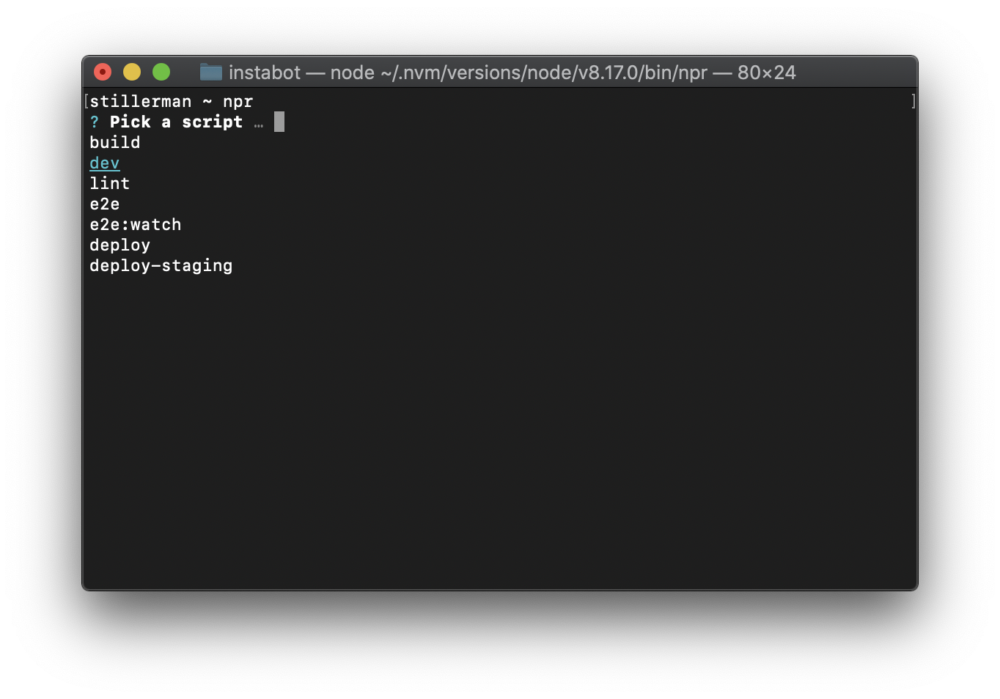

# `NPR`
### What is `npr`?
This tool lists and runs available scripts from a project's `package.json`. Get those seconds back.



### Installation
```
yarn global add nps
```
or, if you are old school
```
npm install -g nps
```

### Why the name?
`npr` is right at home with `npm` and `npx`. Think "npm run".
